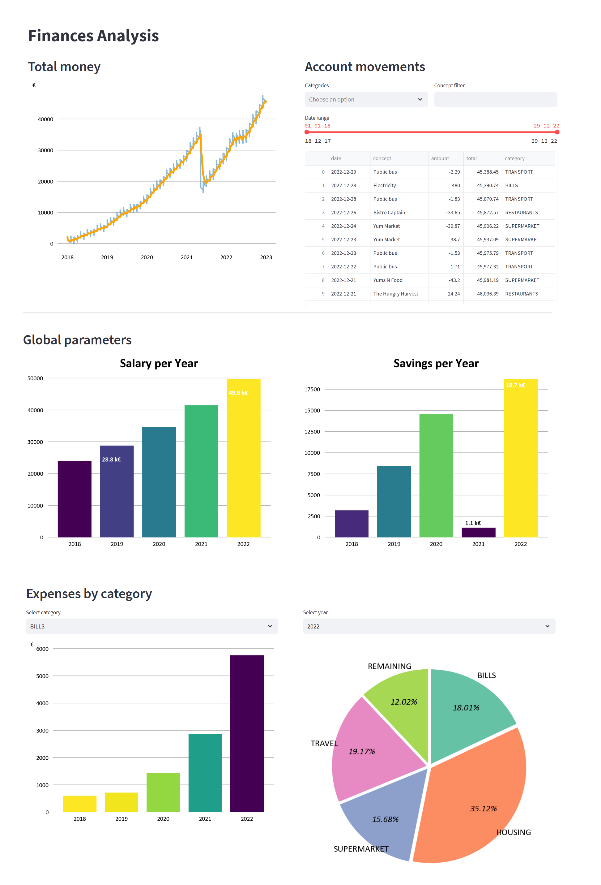

# myfi
Easy way to analyze the CSV/excel data from your bank accounts.
You can upload them, configure your custom categories and rules, and obtain a visual analysis.

This was created with two different purposes:
1. Be able to analyse all my expenses and savings from different accounts.
2. Apply all I learnt in "[Architecture Patterns with Python](https://www.cosmicpython.com/)"

## Installing
### Requirements
```
pip install -r requirements/common.txt
```

### Launch db
If you do not have an available db with the config specified at `config/database.yml`,
it is possibl to launch it using the provided `docker-compose.yml`:
```
docker-compose up -d
```

## Usage
### Uploading data
```
src/cli.py add-data data/source_dummy_01012018_to_31122022.csv
```

Rules to exclude data can be configured in the `configuration/rules.yml` file.
### Categorization
Can be customized in the `configuration/categories.yml` file.
For each category you can create lots of keywords or sentences to be detected.
```
src/cli.py insert-categories
```

### Visual analysis
```
src/cli.py launch-gui
```



## Launching tests
```
pip install -r requirements/test.txt
pytest
```
